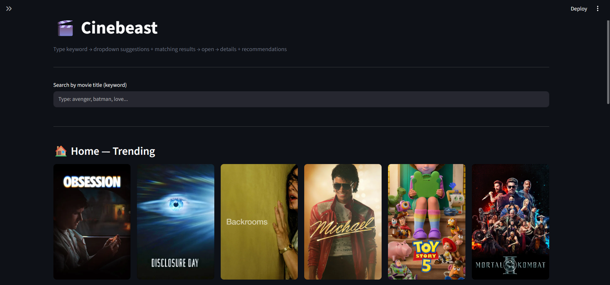
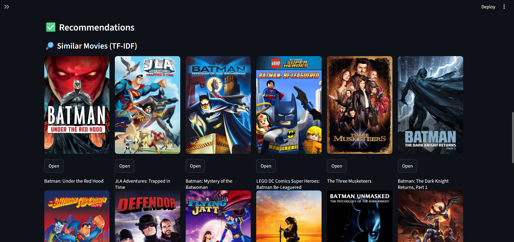

# Cinebeast - Movie Recommendation System

**Portfolio Project**

## Overview
Cinebeast is a personal project I built to learn and demonstrate full-stack application development with machine learning integration. It provides movie recommendations based on a combination of Content-Based Filtering (using TF-IDF on movie overviews and metadata) and the TMDB API.

## Screenshots

### Home Page (Trending Movies)


### Recommendations (Similar Movies via TF-IDF)


## Features
- **Search Movies**: Type a movie name to get suggestions and search results.
- **Movie Details**: View movie information, posters, release dates, and overviews.
- **Recommendations**:
  - Content-based recommendations using TF-IDF (Term Frequency-Inverse Document Frequency) similarity on local data.
  - Genre-based recommendations using the TMDB API.
- **Home Feed**: See trending, popular, top-rated, and upcoming movies.

## Tech Stack & Algorithms
- **Frontend**: Streamlit
- **Backend API**: FastAPI, Uvicorn, `httpx` (for async requests)
- **Data Processing**: Pandas, NumPy
- **Natural Language Processing (NLP)**: Scikit-learn (TF-IDF Vectorizer) to convert movie text data into numerical vectors.
- **Recommendation Engine**:
  - **Content-Based Filtering**: Recommending movies based on similarity to a selected movie.
  - **Cosine Similarity**: Using matrix multiplication on normalized TF-IDF vectors to calculate similarity scores.
  - **In-Memory Storage**: Instead of a dedicated Vector Database, the pre-computed sparse matrix is loaded directly into RAM (`tfidf_matrix.pkl`) for real-time, low-latency inference.
- **External API**: TMDB API (The Movie Database) for dynamic posters, backdrops, and genre-based fallback recommendations.
- **Deployment**: Render (Backend Web Service) & Streamlit Community Cloud (Frontend UI).

## Setup Instructions

1. Clone the repository.
2. Install the required dependencies:
   ```bash
   pip install -r requirements.txt
   ```
3. Set up the environment variables. Create a `.env` file in the root directory and add your TMDB API Key:
   ```env
   TMDB_API_KEY=your_api_key_here
   API_BASE=http://127.0.0.1:8000
   ```
4. Start the backend FastAPI server:
   ```bash
   uvicorn main:app --reload
   ```
5. Start the Streamlit frontend in a separate terminal:
   ```bash
   streamlit run app.py
   ```

## Project Structure
- `app.py`: The Streamlit frontend application.
- `main.py`: The FastAPI backend serving recommendations and TMDB data.
- `movies.ipynb`: Jupyter notebook containing the data exploration and model training (TF-IDF vectorization).
- Data files (`.pkl`): Pickled models, indices, and DataFrames generated from the notebook.

## Future Work
- Implement Collaborative Filtering using user ratings.
- Add user authentication to allow users to save favorite movies.
- Improve error handling for missing poster images.
